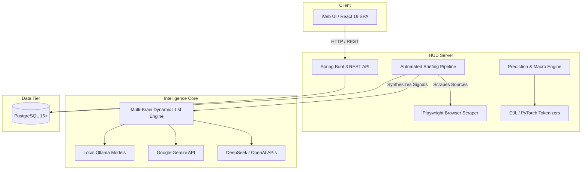

# HUD (Heads-Up Display)

[](https://openjdk.org/)
[](https://spring.io/projects/spring-boot)
[](https://react.dev/)
[](https://vitejs.dev/)
[](https://playwright.dev/java/)
[](LICENSE)

**HUD** is an automated intelligence aggregator, situational synthesis pipeline, and predictive macroeconomic platform. It ingests open-source signals across news feeds, military think-tank publications, and macroeconomic indicators, synthesizes multi-category daily intelligence briefings through configurable Large Language Models (Multi-Brain), and surfaces both analytical dashboards and market predictions in a modern React single-page application.

---

## Architecture Overview

HUD is built as a multi-module Maven project where the frontend SPA is compiled and embedded inside the backend JAR:



---

## Features

* **Multi-Brain Intelligence Engine**: Configure multiple local (Ollama) and cloud (Gemini, DeepSeek) models to synthesize briefings in parallel with side-by-side output comparison.
* **7 Intelligence Domains**: Automated synthesis across World News, US Domestic Policy, Tech Macro, Ukraine Theater SITREP, Middle East SITREP, Indo-Pacific Deterrence, and Global SITREPs.
* **Dynamic Browser & Static Ingestion**: Hybrid scraper using Playwright headless Chromium for dynamic SPAs and Readability4j/Jsoup for clean article extraction.
* **Macroeconomic Pods & Asset Tracking**: Real-time monitoring of Equities, Commodities, Monetary Yields (FRED 10Y-2Y Spread), and Digital Assets with interactive Recharts historical charts.
* **AI Market Forecasts**: Automated multi-horizon predictions (`BULLISH`/`BEARISH`), confidence ratings, key catalysts, and risk factors.
* **Full Observability Dashboard**: Real-time tracking of pipeline durations, token counts, success states, and collapsible error traces.
* **Enterprise Security**: Role-based access control, BCrypt password hashing, session hardening, and mandatory first-login credential rotation.

---

## Quickstart (Containerized)

The fastest and recommended way to run HUD with its dedicated database:

### 1. Build Artifacts & Start Containers
```bash
# Optional: specify a custom admin password (otherwise a random token is printed in logs)
export HUD_ADMIN_PASSWORD="YourSecurePassword123!"

# Build and start app and database
./bin/deploy.sh --build
```

### 2. Access the Application
* **Web Application**: [http://localhost:8889/](http://localhost:8889/)
* **API Health / News**: [http://localhost:8889/api/briefings/latest?category=WORLD_NEWS](http://localhost:8889/api/briefings/latest?category=WORLD_NEWS)
* **PostgreSQL Database**: Exposed on host port `6432` (`huduser` / `hudpass`)

### 3. Monitor Logs
```bash
docker compose logs -f app
```

### 4. Stop Services
```bash
docker compose down
```

---

## Development & Automation Scripts

Convenient, location-independent scripts are provided in `bin/`:

| Script | Purpose |
| :--- | :--- |
| **`./bin/build.sh --clean`** | Full clean build with test suite, PMD, SpotBugs, and JaCoCo coverage. |
| **`./bin/build.sh --fast`** | Quick build skipping tests and static analysis. |
| **`./bin/test.sh --unit`** | Run fast unit tests (in-memory H2, no Docker or Ollama required). |
| **`./bin/test.sh --int`** | Run full integration test suite (requires Docker/Testcontainers). |
| **`./bin/deploy.sh --build`** | Build host JAR and launch Docker Compose stack. |
| **`./bin/db-backup.sh`** | Create timestamped compressed database snapshot in `backups/`. |
| **`./bin/db-restore.sh <file>`** | Restore a database backup into the PostgreSQL container. |

---

## Frontend Development

Run the frontend independently during local development with hot reloading:

```bash
cd hud-frontend
npm run dev        # Starts Vite dev server with proxy to backend (http://localhost:8889)
npm test           # Runs Vitest unit tests (MSW mocked)
npm run lint       # Runs ESLint
npm run build      # Produces optimized production bundle
```

---

## Documentation Index

Explore in-depth architectural and operational guides in the [`docs/`](docs/) directory:

| Guide | Description |
| :--- | :--- |
| **[System Architecture](docs/architecture.md)** | Core architecture, design patterns, module packaging, and data flow. |
| **[Multi-Brain Engine](docs/multi-brain-engine.md)** | LLM providers (Ollama, Gemini, DeepSeek), personas, dynamic runtime instantiation, and model comparison. |
| **[Briefing Pipeline](docs/briefing-pipeline.md)** | Daily synthesis lifecycle, categories, source tiers, and HTML rendering. |
| **[Scraping & Ingestion](docs/scraping-and-ingestion.md)** | Playwright headless browser automation, static parsing, and content cleaners. |
| **[Market & Predictive Analytics](docs/market-and-predictive-analytics.md)** | Macro pods, DJL neural sentiment scoring, prediction generation, and historical harvesting scripts. |
| **[REST API Reference](docs/api-reference.md)** | Complete endpoint reference for Auth, Briefings, Macro Investments, Config, and Pipelines. |
| **[Database Schema & Migrations](docs/database-and-migrations.md)** | Flyway migration history, ER diagram, and backup/restore procedures. |
| **[Security & Authentication](docs/security-and-auth.md)** | RBAC, session configuration, password rotation, and admin security. |
| **[Frontend Guide](docs/frontend-guide.md)** | React 19 architecture, component hierarchy, Recharts, and UI styling. |
| **[Deployment & Operations](docs/deployment-and-operations.md)** | Docker configuration, environment variables, monitoring, and troubleshooting. |
| **[Model Configuration](docs/ModelConfig.md)** | Quick-start reference for local and cloud LLM settings. |

---

## License

This project is open source and available under the [MIT License](LICENSE).
