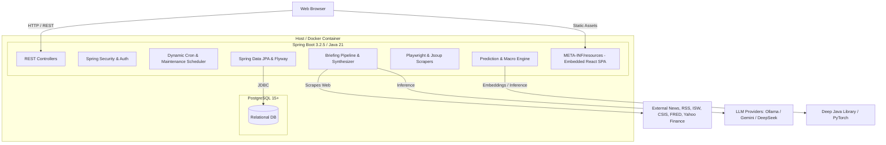
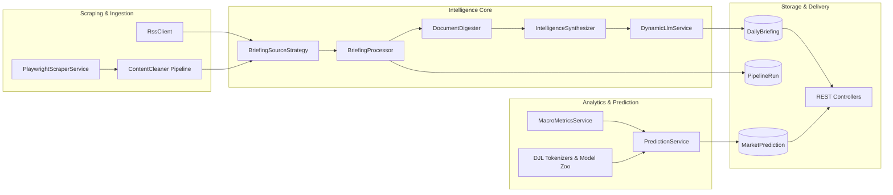

# HUD System Architecture

The **Heads-Up Display (HUD)** is an automated intelligence aggregator, situational synthesis pipeline, and predictive market intelligence platform. It ingests open-source signals across news feeds, military/think-tank reports, and macroeconomic indicators, synthesizes multi-category daily intelligence briefings through pluggable Large Language Models (Multi-Brain), and serves both analytical dashboards and predictive metrics via an embedded React SPA.

---

## 1. System Overview & Monorepo Structure

HUD is organized as a multi-module Maven project where the frontend SPA is compiled and embedded into the Spring Boot backend JAR during the Maven build lifecycle.

### Module Responsibilities

| Module / Directory | Role | Description |
| :--- | :--- | :--- |
| **`hud-backend/`** | Backend Server | Spring Boot application containing all domain logic, REST APIs, scraper services, LLM synthesis, scheduled tasks, and persistence. |
| **`hud-frontend/`** | Frontend SPA | React 19 + TypeScript + Vite single-page application providing dashboards for News, Theaters, Investments, Observability, and Admin Configuration. |
| **`bin/`** | CLI Automation | Shell wrappers (`build.sh`, `deploy.sh`, `test.sh`, `run.sh`, `db-backup.sh`, `db-restore.sh`) for development and operations. |
| **`docs/`** | Documentation | Architectural, operational, API, and subsystem documentation. |

---

## 2. High-Level Architecture

HUD backend is divided into two primary domain boundaries:
1. **`com.hud.briefing`**: Intelligence synthesis, multi-brain management, persona prompting, dynamic scheduling, pipeline observability, and authentication.
2. **`com.hud.news`**: Data harvesting, headless Playwright scraping, static parsing, macro indicators, sentiment analytics, and predictive market models.

---

## 3. Core Design Patterns

### 3.1. Strategy Pattern for Ingestion & Sources
* **`ScraperStrategy<T>`**: Dedicated scrapers for individual data sources (e.g., [`YahooMetricScraperStrategy`](file:///home/jakefear/source/hud/hud-backend/src/main/java/com/hud/news/YahooMetricScraperStrategy.java), [`FredYieldScraperStrategy`](file:///home/jakefear/source/hud/hud-backend/src/main/java/com/hud/news/FredYieldScraperStrategy.java), [`IswScraperStrategy`](file:///home/jakefear/source/hud/hud-backend/src/main/java/com/hud/news/IswScraperStrategy.java), [`CsisScraperStrategy`](file:///home/jakefear/source/hud/hud-backend/src/main/java/com/hud/news/CsisScraperStrategy.java)).
* **`BriefingSourceStrategy`**: Encapsulates candidate URL discovery for specific briefing categories (e.g., [`DatabaseSourceStrategy`](file:///home/jakefear/source/hud/hud-backend/src/main/java/com/hud/briefing/DatabaseSourceStrategy.java)).

### 3.2. Factory Pattern for Processing & Providers
* **`BriefingProcessorFactory`**: Constructs specialized `BriefingProcessor` instances tailored to category requirements (e.g., standard general news vs. deep-dive theater SITREPs with custom token budgets and synthesis strategies).
* **`BriefingSourceFactory`**: Dispatches the appropriate source selection strategy based on category context.
* **`LlmProvider` implementations**: `OllamaModelProvider`, `GeminiModelProvider`, `DeepSeekModelProvider` construct runtime `ChatLanguageModel` instances via LangChain4j.

### 3.3. Multi-Brain Provider Abstraction
Models are database-backed rather than hardcoded. The [`LlmConfig`](file:///home/jakefear/source/hud/hud-backend/src/main/java/com/hud/briefing/LlmConfig.java) entity defines provider types, endpoints, API keys, and context window limits. [`DynamicLlmService`](file:///home/jakefear/source/hud/hud-backend/src/main/java/com/hud/briefing/DynamicLlmService.java) instantiates LangChain4j chat models dynamically at runtime.

---

## 4. Frontend & Backend Packaging Flow

The frontend is built during standard Maven compilation:
1. `frontend-maven-plugin` downloads Node & npm, executes `npm install`, runs Vitest unit tests (`npm test`), and bundles the app (`npm run build`).
2. `maven-resources-plugin` copies the compiled `hud-frontend/dist` directory into `hud-backend/target/classes/META-INF/resources`.
3. [`SpaWebMvcConfigurer`](file:///home/jakefear/source/hud/hud-backend/src/main/java/com/hud/SpaWebMvcConfigurer.java) configures Spring Boot resource handlers and forwards client-side routes (e.g. `/news`, `/theaters`, `/investments`, `/config`, `/observability`) to `index.html` while preserving API routes under `/api/**`.

---

## 5. Next Steps & Detailed Guides

* [Multi-Brain Intelligence Engine](multi-brain-engine.md)
* [Briefing Pipeline & Synthesis](briefing-pipeline.md)
* [Scraping & Ingestion Subsystems](scraping-and-ingestion.md)
* [Market & Predictive Analytics](market-and-predictive-analytics.md)
* [REST API Reference](api-reference.md)
* [Database Schema & Migrations](database-and-migrations.md)
* [Security & Authentication](security-and-auth.md)
* [Frontend Architecture & UI Guide](frontend-guide.md)
* [Deployment & Operations Guide](deployment-and-operations.md)
