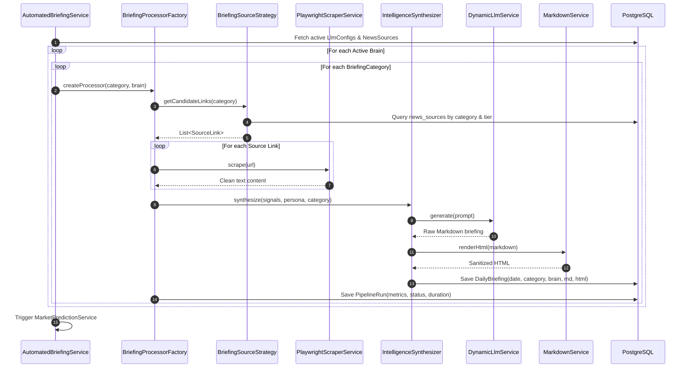

# Intelligence Briefing Pipeline

The HUD Briefing Pipeline is an automated, asynchronous processing engine that orchestrates source discovery, web scraping, content sanitization, LLM synthesis, HTML rendering, and persistent observability across all briefing categories and active model configurations.

---

## 1. Pipeline Execution Flow

The briefing pipeline runs on configurable cron schedules (default `0 0 6 * * *` daily at 06:00 UTC) or can be triggered on-demand via the administrative API (`POST /api/pipeline/trigger`).

---

## 2. Briefing Categories

The pipeline processes 7 distinct intelligence domains:

| Category Enum | Display Title | Scope & Objectives |
| :--- | :--- | :--- |
| **`WORLD_NEWS`** | Global World News | International headlines, multilateral relations, treaty summits, global crises. |
| **`US_NEWS`** | US Domestic Policy & News | Congressional legislation, executive orders, economic policy, domestic developments. |
| **`TECH_MACRO`** | Technology & Macro Strategy | AI models & infrastructure, semiconductors, venture capital trends, cyber defense. |
| **`THEATER_UKRAINE`** | Ukraine Theater SITREP | Tactical contact lines, artillery/drone attrition, deep strikes, logistical hubs. |
| **`THEATER_MIDDLE_EAST`** | Middle East Theater SITREP | Regional conflicts, maritime choke points, air defense engagements, proxy forces. |
| **`THEATER_INDO_PACIFIC`** | Indo-Pacific Deterrence | Taiwan Strait, South China Sea, joint military exercises, island chain defense. |
| **`GLOBAL_SITREP`** | Strategic Global SITREP | Cross-theater strategic fusion, multi-domain escalation risks, great power posture. |

---

## 3. Source Management & Source Tiers

Sources are configured in the `news_sources` table and managed via the `/config` UI. Each source has:
* **`url`**: RSS endpoint or direct article/portal URL.
* **`category`**: Target `BriefingCategory`.
* **`sourceType`**: `RSS`, `SCRAPER` (Playwright), or `STATIC_HTML`.
* **`tier`**: Priority weight tier (`PRIMARY`, `SECONDARY`, `TERTIARY`).
* **`weight`**: Priority multiplier (1-100) determining the token quota allocated during document ingestion.
* **`active`**: Boolean flag to enable or disable source inclusion.

---

## 4. Synthesis Strategies

[`BriefingProcessorFactory`](file:///home/jakefear/source/hud/hud-backend/src/main/java/com/hud/briefing/BriefingProcessorFactory.java) selects the synthesis algorithm based on category:

1. **`StandardSynthesisStrategy`**:
   * Used for `WORLD_NEWS`, `US_NEWS`, and `TECH_MACRO`.
   * Fast, single-stage synthesis summarizing top weighted articles into categorized executive sections with source citations.
2. **`TheaterFusionStrategy`**:
   * Used for `THEATER_UKRAINE`, `THEATER_MIDDLE_EAST`, and `THEATER_INDO_PACIFIC`.
   * Integrates military think-tank publications (ISW, CSIS) and theater-specific feeds.
   * Produces structured SITREPs with:
     * Operational Summary
     * Tactical/Frontline Changes
     * Strategic/Logistical Assessment
     * 24-48 Hour Outlook
3. **`GlobalSitrepStrategy`**:
   * Used for `GLOBAL_SITREP`.
   * Synthesizes cross-theater outputs from the regional theaters into an overarching national security perspective.

---

## 5. Markdown & HTML Rendering

Briefings are stored in dual formats in the `daily_briefings` table:
* **`content`**: Raw GitHub-flavored Markdown produced by the LLM.
* **`renderedHtml`**: Clean, sanitized HTML converted by [`MarkdownService`](file:///home/jakefear/source/hud/hud-backend/src/main/java/com/hud/briefing/MarkdownService.java) using CommonMark with extensions:
  * `TablesExtension`: Render structured data comparison tables.
  * `StrikethroughExtension`: Render strike-through text.
  * `AutolinkExtension`: Automatically convert source URLs into clickable hyperlinks.

---

## 6. Pipeline Observability & Failure Handling

Every execution records a [`PipelineRun`](file:///home/jakefear/source/hud/hud-backend/src/main/java/com/hud/briefing/PipelineRun.java) entity:
* **`status`**: `SUCCESS`, `FAILED`, or `PARTIAL`.
* **`durationMs`**: Total latency in milliseconds.
* **`tokenCount`**: Input and output token counts when reported by provider.
* **`errorMessage`**: Full exception cause-chain stored if an individual category or model fails.
* **Fault Isolation**: If a single source fails to scrape or a model times out, the pipeline logs the error, records the `PipelineRun`, and continues processing remaining categories and models without halting the entire system.
