# Database Schema & Migrations

HUD uses **PostgreSQL** as its primary production datastore with schema migrations managed deterministically via **Flyway**. In-memory H2 is utilized for isolated unit testing, while Testcontainers runs ephemeral PostgreSQL instances for integration testing.

---

## 1. Entity Relationship Model

```mermaid
erDiagram
    USERS {
        bigint id PK
        varchar username UK
        varchar password
        varchar role
        boolean password_change_required
    }

    LLM_CONFIGS {
        bigint id PK
        varchar name UK
        varchar provider
        varchar base_url
        varchar model_name
        varchar api_key
        integer context_window
        double_precision temperature
        boolean active
    }

    DAILY_BRIEFINGS {
        bigint id PK
        date date
        varchar category
        varchar model_name
        text content
        text rendered_html
        timestamp created_at
    }

    NEWS_SOURCES {
        bigint id PK
        varchar name
        varchar url
        varchar category
        varchar source_type
        varchar tier
        integer weight
        boolean active
    }

    BRIEFING_SCHEDULES {
        bigint id PK
        varchar category UK
        varchar cron_expression
        boolean enabled
    }

    MACRO_METRICS {
        bigint id PK
        varchar ticker UK
        varchar name
        varchar category
        double_precision current_value
        double_precision change_24h
        double_precision change_percent_24h
        timestamp last_updated
    }

    METRIC_HISTORIES {
        bigint id PK
        varchar ticker
        date date
        double_precision close_price
        bigint volume
    }

    MARKET_PREDICTIONS {
        bigint id PK
        varchar ticker
        varchar direction
        varchar time_horizon
        double_precision confidence
        text catalysts
        text risks
        timestamp created_at
    }

    PIPELINE_RUNS {
        bigint id PK
        varchar category
        varchar model_name
        varchar status
        bigint duration_ms
        integer input_tokens
        integer output_tokens
        text error_message
        timestamp run_at
    }

    WEEKLY_INSIGHTS {
        bigint id PK
        date week_starting
        text synthesis_content
        text rendered_html
        timestamp created_at
    }
```



---

## 2. Migration History (Flyway)

All migrations are version-controlled under `hud-backend/src/main/resources/db/migration/`:

| Version | Migration Script | Description |
| :--- | :--- | :--- |
| **V1** | [`V1__baseline.sql`](file:///home/jakefear/source/hud/hud-backend/src/main/resources/db/migration/V1__baseline.sql) | Creates foundational tables (`users`, `daily_briefings`, `macro_metrics`, `metric_histories`, `market_predictions`, `pipeline_runs`, `llm_configs`). |
| **V2** | [`V2__add_password_change_required.sql`](file:///home/jakefear/source/hud/hud-backend/src/main/resources/db/migration/V2__add_password_change_required.sql) | Adds `password_change_required` boolean column to `users` for mandatory first-login password rotation. |
| **V3** | [`V3__create_news_sources.sql`](file:///home/jakefear/source/hud/hud-backend/src/main/resources/db/migration/V3__create_news_sources.sql) | Creates `news_sources` table and seeds baseline RSS and scraper feeds (BBC, Reuters, DefenseOne, ISW, CSIS, etc.). |
| **V4** | [`V4__seed_briefing_schedules.sql`](file:///home/jakefear/source/hud/hud-backend/src/main/resources/db/migration/V4__seed_briefing_schedules.sql) | Creates `briefing_schedules` table for category-level dynamic cron job scheduling. |
| **V5** | [`V5__seed_llm_config.sql`](file:///home/jakefear/source/hud/hud-backend/src/main/resources/db/migration/V5__seed_llm_config.sql) | Seeds initial default local Ollama model definition. |
| **V6** | [`V6__weekly_insights_and_cleanup.sql`](file:///home/jakefear/source/hud/hud-backend/src/main/resources/db/migration/V6__weekly_insights_and_cleanup.sql) | Adds `weekly_insights` table for cross-asset macro summaries. |

---

## 3. Database Operations & Backups

Helper scripts in `bin/` provide zero-downtime backup and restore workflows against the PostgreSQL container:

### 3.1. Create a Snapshot (`bin/db-backup.sh`)
Executes `pg_dump` from inside the `hud-db` container and saves timestamped gzip archives to `backups/`:
```bash
./bin/db-backup.sh
# Creates: backups/hud_backup_YYYYMMDD_HHMMSS.sql.gz
```

### 3.2. Restore from a Snapshot (`bin/db-restore.sh`)
Restores a specific database archive:
```bash
./bin/db-restore.sh backups/hud_backup_20260816_120000.sql.gz
```
