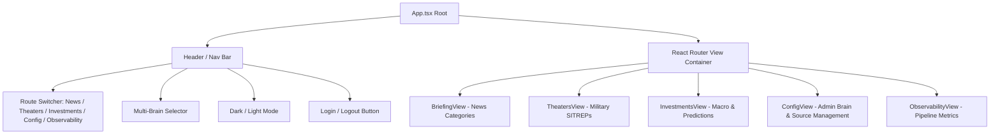

# Frontend Architecture & UI Guide

The HUD frontend is a high-performance **React 19** Single-Page Application written in **TypeScript** and bundled with **Vite**. It is styled with **Tailwind CSS** and **Radix UI**, providing real-time intelligence feeds, interactive financial charts, multi-brain model switching, and administrative controls.

---

## 1. Application Layout & Navigation

The root component ([`App.tsx`](file:///home/jakefear/source/hud/hud-frontend/src/App.tsx)) establishes top-level navigation, theme context, auth state, and the active Brain selector:



---

## 2. Views & Key Components

### 2.1. Briefing & News Views ([`BriefingView.tsx`](file:///home/jakefear/source/hud/hud-frontend/src/components/BriefingView.tsx))
* Displays general intelligence categories (`WORLD_NEWS`, `US_NEWS`, `TECH_MACRO`).
* Renders sanitized HTML or Markdown with table formatting, source hyperlinks, and date pickers.
* Dynamically re-renders content when the user switches the active Brain in the header.

### 2.2. Military Theaters & Strategic SITREPs ([`TheatersView.tsx`](file:///home/jakefear/source/hud/hud-frontend/src/components/TheatersView.tsx))
* Structured tabs for active conflict zones (`THEATER_UKRAINE`, `THEATER_MIDDLE_EAST`, `THEATER_INDO_PACIFIC`, `GLOBAL_SITREP`).
* High-density tactical layout highlighting frontline changes, electronic warfare updates, and logistics assessments.

### 2.3. Investments & Macroeconomic Dashboard ([`InvestmentsView.tsx`](file:///home/jakefear/source/hud/hud-frontend/src/components/InvestmentsView.tsx))
* **Macro Pods ([`MacroPodCard.tsx`](file:///home/jakefear/source/hud/hud-frontend/src/components/MacroPodCard.tsx))**: Visual cards grouping equities, commodities, monetary metrics, and digital assets.
* **Interactive Charts ([`MetricChart.tsx`](file:///home/jakefear/source/hud/hud-frontend/src/components/MetricChart.tsx))**: Recharts time-series line graphs with tooltips, date zoom, and percentage change overlays.
* **Market Predictions ([`MarketPredictionDashboard.tsx`](file:///home/jakefear/source/hud/hud-frontend/src/components/MarketPredictionDashboard.tsx))**: AI-generated directional forecasts (`BULLISH`/`BEARISH`), confidence gauges, catalysts, and downside risks.
* **Strategic Insights ([`StrategicInsightsView.tsx`](file:///home/jakefear/source/hud/hud-frontend/src/components/StrategicInsightsView.tsx))**: Weekly cross-asset macroeconomic summaries.

### 2.4. Administration & Brain Management ([`ConfigView.tsx`](file:///home/jakefear/source/hud/hud-frontend/src/components/ConfigView.tsx))
* **Brain Configurator**: Interactive modal and cards to add, test, edit, and toggle Ollama, Gemini, or DeepSeek models.
* **News Sources**: Manage RSS URLs, scrape weights, and category assignments.
* **Scheduling**: Edit category cron expressions ([`SchedulingConfig.tsx`](file:///home/jakefear/source/hud/hud-frontend/src/components/SchedulingConfig.tsx)).

### 2.5. Pipeline Observability ([`ObservabilityView.tsx`](file:///home/jakefear/source/hud/hud-frontend/src/components/ObservabilityView.tsx))
* Real-time table of recent pipeline executions.
* Displays status badges (`SUCCESS`, `FAILED`), execution durations, token statistics, and full collapsible error stack traces.

---

## 3. Development & Testing Commands

Run the frontend independently during local development:

```bash
cd hud-frontend

# Start Vite dev server with proxy to backend (http://localhost:8889)
npm run dev

# Run Vitest component tests (with Mock Service Worker)
npm test

# Run ESLint
npm run lint

# Build production bundle
npm run build
```
