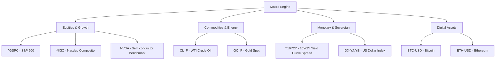

# Market & Predictive Analytics

HUD combines real-time macroeconomic metric tracking, multi-asset pod groupings, historical price trend harvesting, Deep Java Library (DJL) neural embeddings/sentiment scoring, and automated LLM-driven market predictions.

---

## 1. Macro Pods & Asset Tracking

Financial indicators are grouped into contextual **Macro Pods** defined in [`MacroMetricsService`](file:///home/jakefear/source/hud/hud-backend/src/main/java/com/hud/news/MacroMetricsService.java):



### Pod Data Representation
* **Current Price & Unit**: Normalized float values (currency `$`, percentage `%`, index points).
* **24h Change**: Absolute and percentage change.
* **Sparkline Historical Series**: 30-day and 90-day price arrays rendered in interactive SVG/Canvas charts via Recharts in the frontend.

---

## 2. Predictive Analytics Engine

[`PredictionService`](file:///home/jakefear/source/hud/hud-backend/src/main/java/com/hud/news/PredictionService.java) executes after daily briefings or on demand:
1. **Multi-Modal Feature Assembly**: Compiles the day's macroeconomic pod data, yield curve inversion status, recent news synthesis, and historical volatility.
2. **Deep Java Library (DJL) Sentiment Scoring**: Utilizes DJL PyTorch tokenizers and model zoo bindings to evaluate market sentiment vectors.
3. **Structured Forecast Synthesis**: Prompts the active LLM to generate a structured [`MarketPrediction`](file:///home/jakefear/source/hud/hud-backend/src/main/java/com/hud/news/MarketPrediction.java) object:
   * **Target Asset / Index**: (e.g. S&P 500, Gold, Bitcoin).
   * **Direction**: `BULLISH`, `BEARISH`, `NEUTRAL`, or `VOLATILE`.
   * **Time Horizon**: 24-Hour, 7-Day, or 30-Day.
   * **Confidence Score**: 0.0 - 1.0 probability index.
   * **Primary Catalysts**: Top 3 driving macroeconomic or geopolitical forces.
   * **Downside Risks**: Key invalidation scenarios and tail-risk warnings.

---

## 3. Historical Data Harvesting

Historical data seeds are maintained and regenerated using standalone Python scripts located at the repository root:

### 3.1. Global Bootstrap (`harvest_global.py`)
Fetches long-term historical time series for major global market benchmarks from Yahoo Finance (`yfinance`) and writes SQL insert statements into `bootstrap_global.sql`:
```bash
python harvest_global.py
```

### 3.2. History Bootstrap (`harvest_history.py`)
Pulls recent multi-year daily closing prices and volume metrics for active watchlist assets and writes SQL insert statements into `bootstrap_history.sql`:
```bash
python harvest_history.py
```

> [!TIP]
> Both `bootstrap_global.sql` and `bootstrap_history.sql` are excluded from version control to prevent repository bloat. Run these harvesting scripts when initializing a fresh database instance.

---

## 4. Weekly Insights Pipeline

The [`WeeklyInsightsPipeline`](file:///home/jakefear/source/hud/hud-backend/src/main/java/com/hud/news/WeeklyInsightsPipeline.java) runs on a weekly schedule (`0 0 12 * * SUN`):
* Aggregates 7-day macro metric deltas and daily prediction accuracy.
* Generates a structured [`WeeklyInsight`](file:///home/jakefear/source/hud/hud-backend/src/main/java/com/hud/news/WeeklyInsight.java) report covering cross-asset correlations, yield curve trends, and emerging macroeconomic risks.
* Surfaces in the frontend **Investments** tab under **Strategic Insights**.
