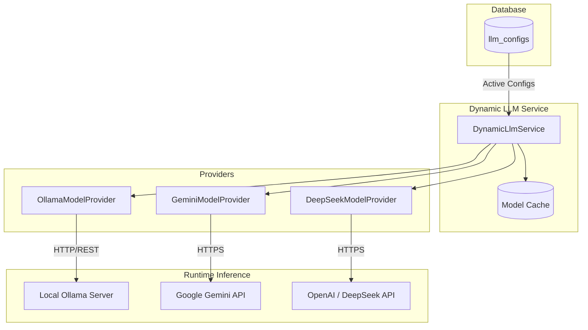
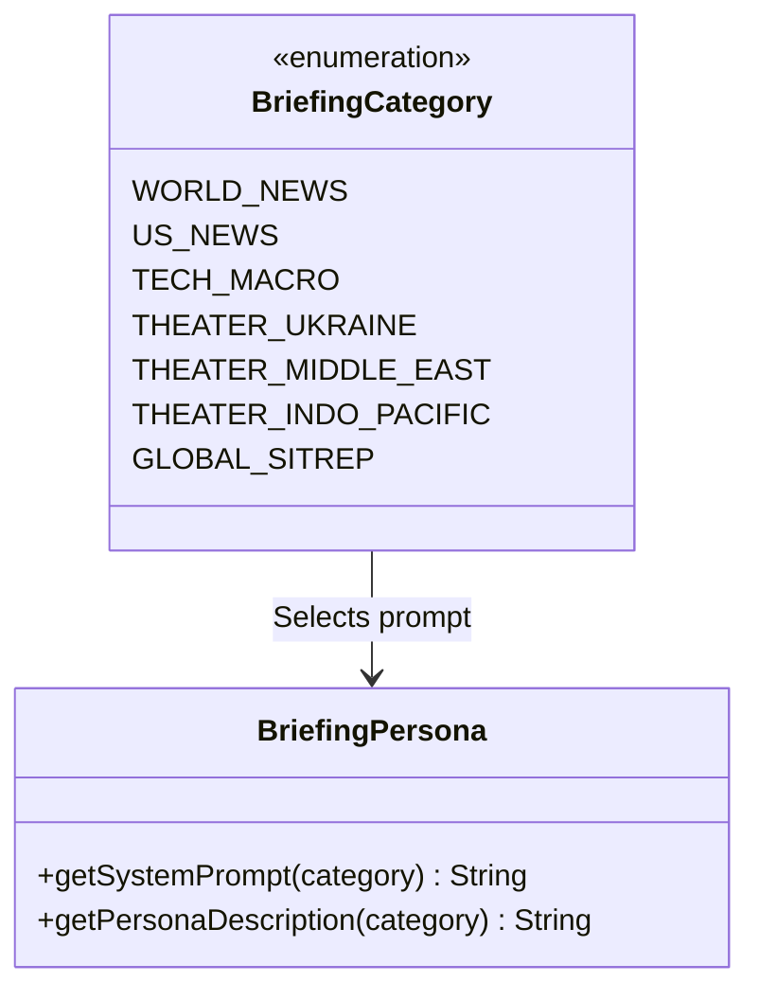

# Multi-Brain Intelligence Engine

The HUD utilizes a dynamic, database-backed **Multi-Brain Intelligence Engine**. This architecture enables the system to leverage heterogeneous Large Language Models (local on-premise hardware, cloud APIs, specialized reasoning models) concurrently for situational synthesis, side-by-side output evaluation, and tailored persona prompting.

---

## 1. Concept & Multi-Brain Architecture

Rather than hardcoding a single LLM client, HUD decouples model definitions from the pipeline:
1. **Database-Backed Brains**: Each model configuration is stored as a row in the `llm_configs` table (`LlmConfig` entity).
2. **Dynamic Instantiation**: [`DynamicLlmService`](file:///home/jakefear/source/hud/hud-backend/src/main/java/com/hud/briefing/DynamicLlmService.java) dynamically creates and caches [`ChatLanguageModel`](https://docs.langchain4j.dev/) instances at runtime based on active database rows.
3. **Multi-Model Execution**: When a briefing cycle triggers, the pipeline iterates over **every active Brain** for each category.
4. **Side-by-Side Comparison**: Daily briefings are keyed by `(date, category, modelName)`. Users can switch between Brains in the web UI header to inspect how different models interpret the same raw news signals.

---

## 2. Supported LLM Providers

### 2.1. Ollama (Local / Self-Hosted)
* **Provider Enum**: `OLLAMA`
* **Use Case**: Privacy-preserving, offline, local hardware execution (e.g., `gemma4:e4b`, `llama3.3:70b`, `mistral-nemo`).
* **Configuration Parameters**:
  * **Base URL**: The endpoint of your Ollama server (e.g., `http://localhost:11434` or `http://inference.local:11434`).
  * **Model Name**: The Ollama tag (e.g., `gemma4:e4b`).
  * **Context Window**: Integer token count (e.g., `65536` for 64k deep-dive theater synthesis).
  * **Temperature**: Float sampling temperature (default `0.2` for deterministic analytic rigor).

### 2.2. Google Gemini (Cloud / API)
* **Provider Enum**: `GEMINI`
* **Use Case**: High-reasoning cloud synthesis with massive context windows using Google's Flash and Pro models (e.g., `gemini-2.0-flash`, `gemini-2.0-pro-exp-02-05`).
* **Configuration Parameters**:
  * **API Key**: API key generated from [Google AI Studio](https://aistudio.google.com/).
  * **Model Name**: Gemini model identifier (e.g., `gemini-2.0-flash`).
  * **Temperature**: Sampling temperature (default `0.2`).

### 2.3. DeepSeek / OpenAI Compatible (Cloud / Local)
* **Provider Enum**: `DEEPSEEK` / `OPENAI`
* **Use Case**: OpenAI-compatible REST endpoints (e.g., DeepSeek V3/R1, vLLM, Ollama OpenAI endpoints, OpenRouter).
* **Configuration Parameters**:
  * **Base URL**: Base URL ending in `/v1` (e.g., `https://api.deepseek.com/v1`).
  * **API Key**: Provider API key.
  * **Model Name**: Target model ID (e.g., `deepseek-chat`, `deepseek-reasoner`).

---

## 3. Personas & Prompt Engineering

The system uses [`BriefingPersona`](file:///home/jakefear/source/hud/hud-backend/src/main/java/com/hud/briefing/BriefingPersona.java) to apply specialized analytical framing per category:

### Category Framing & Tone
1. **`WORLD_NEWS` / `US_NEWS`**: Senior Intelligence Watch Officer. Concise, objective executive summaries, key developing stories, factual strategic impacts.
2. **`TECH_MACRO`**: Technology Strategist & Macro Venture Analyst. Highlighting AI advancements, semiconductor supply chains, regulatory policy, sovereign compute.
3. **`THEATER_UKRAINE`**: Strategic Military Intelligence Watch (SITREP). Frontline tactical movements, electronic warfare developments, logistical nodes, strategic depth strikes.
4. **`THEATER_MIDDLE_EAST`**: Regional Security & Defense Analyst. Proxy dynamics, maritime chokepoint security (Red Sea/Strait of Hormuz), missile/air defense engagements.
5. **`THEATER_INDO_PACIFIC`**: Maritime & Strategic Deterrence Analyst. Taiwan Strait, South China Sea freedom of navigation, base fortification, naval exercises.
6. **`GLOBAL_SITREP`**: Integrated National Security Advisor synthesis. Cross-theater strategic fusion, multi-domain escalation risks, great power competition.

---

## 4. Document Digesting & Token Budgeting

To prevent context overflow when synthesizing hundreds of scraped articles, [`DocumentDigester`](file:///home/jakefear/source/hud/hud-backend/src/main/java/com/hud/briefing/DocumentDigester.java) performs map-reduce or sliding-budget chunking:
* **Token Budget**: Dynamic based on the model's configured context window.
* **Per-Article Digests**: Articles exceeding threshold length are summarized into [`ArticleDigest`](file:///home/jakefear/source/hud/hud-backend/src/main/java/com/hud/briefing/ArticleDigest.java) intermediate structures before final synthesis.
* **Synthesis Strategy**: Dispatches between standard single-pass fusion and multi-tier deep-dive fusion strategies.

---

## 5. Administration & Observability

* **Config UI (`/config`)**: Add, modify, test, activate, or deactivate Brains at runtime without restarting the backend.
* **Observability UI (`/observability`)**: Tracks execution metrics per Brain across every pipeline run, including:
  * Duration (ms)
  * Token input/output counts
  * Success / Failure status
  * Error cause-chains and fallback traces
* **Database Seeding**: On initial bootstrap, [`DatabaseSeeder`](file:///home/jakefear/source/hud/hud-backend/src/main/java/com/hud/briefing/DatabaseSeeder.java) inserts a default "Local Gemma" model configuration if no models are configured.
