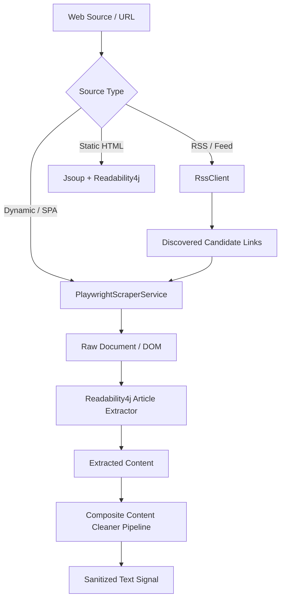
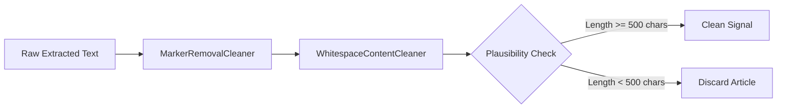

# Scraping & Ingestion Subsystems

HUD features a multi-tiered ingestion engine designed to harvest real-time signals from complex modern web applications, dynamic single-page applications, paywalled or cookie-gated news portals, and structured financial feeds.

---

## 1. Scraping Architecture & Engine Selection

Ingestion utilizes a hybrid architecture:
1. **Dynamic Browser Ingestion (Playwright Java)**: Headless Chromium browser automation used for JavaScript-rendered sites, client-side hydration, and dynamic DOM parsing.
2. **Static DOM & Article Extraction (Jsoup + Readability4j)**: High-speed static parsing and Mozilla Readability algorithm for clean article extraction.
3. **RSS / Atom Feed Discovery (RssClient)**: Fast XML parsing for source discovery and link harvesting.

---

## 2. Playwright Headless Browser Automation

[`PlaywrightScraperService`](file:///home/jakefear/source/hud/hud-backend/src/main/java/com/hud/news/PlaywrightScraperService.java) and [`PlaywrightBrowserManager`](file:///home/jakefear/source/hud/hud-backend/src/main/java/com/hud/news/PlaywrightBrowserManager.java) manage headless Chromium browser instances:
* **Browser Lifecycle**: Managed Chromium instances pooled and reused with thread-safe isolation.
* **Stealth & Emulation**: Sets custom User-Agent headers, viewport sizes, and language headers to prevent bot detection.
* **Cookie & Overlay Bypass**: Intercepts and dismisses common modal overlays, GDPR cookie prompts (`cookies.txt`, `cookies2.txt`), and splash dialogues.
* **Timeout & Fallback**: Configurable page navigation and network idle timeouts (default 15-30s).

> [!NOTE]
> When running in Docker, the application uses the base image `mcr.microsoft.com/playwright/java:v1.49.0-noble` which contains all required Linux system dependencies and browser binaries.

---

## 3. Content Sanitization & Cleaning Pipeline

Raw web content contains navigation menus, copyright notices, tracking scripts, ad copy, and formatting artifacts. HUD uses a composite cleaning pipeline:

* **`MarkerRemovalCleaner`**: Strips cookie warnings, "Subscribe now" prompts, social media sharing tags, and author boilerplate.
* **`WhitespaceContentCleaner`**: Normalizes unicode spaces, collapses repeated newlines, and trims trailing whitespace.
* **Plausibility & Signal Threshold**: Discards pages with fewer than 500 characters of meaningful content to prevent feeding blank pages or bot-detection roadblocks to the LLM.

---

## 4. Specialized Scraper Strategies

### 4.1. `YahooMetricScraperStrategy`
* **Target**: Real-time market metrics (`^GSPC`, `^IXIC`, `GC=F`, `CL=F`, `BTC-USD`, `NVDA`, `TSLA`, etc.).
* **Hybrid Execution**:
  1. Attempts primary Yahoo Finance fast API query.
  2. If the API rate limits or errors, automatically falls back to Playwright headless navigation with CSS selector evaluation (`[data-field='regularMarketPrice']`).

### 4.2. `FredYieldScraperStrategy`
* **Target**: Federal Reserve Economic Data (FRED) 10Y-2Y Treasury Yield Spread (`T10Y2Y`).
* **Execution**: Navigates to the FRED series portal and extracts the latest published spread metric for macroeconomic pod calculations.

### 4.3. `IswScraperStrategy`
* **Target**: Institute for the Study of War (ISW) Daily Assessments.
* **Execution**: Scrapes the ISW research repository, identifies the latest published SITREPs for Ukraine and Middle East theaters, and extracts operational battlefield developments.

### 4.4. `CsisScraperStrategy`
* **Target**: Center for Strategic and International Studies (CSIS) analysis.
* **Execution**: Discovers defense analysis papers, Indo-Pacific strategic postures, and naval exercise reports.
