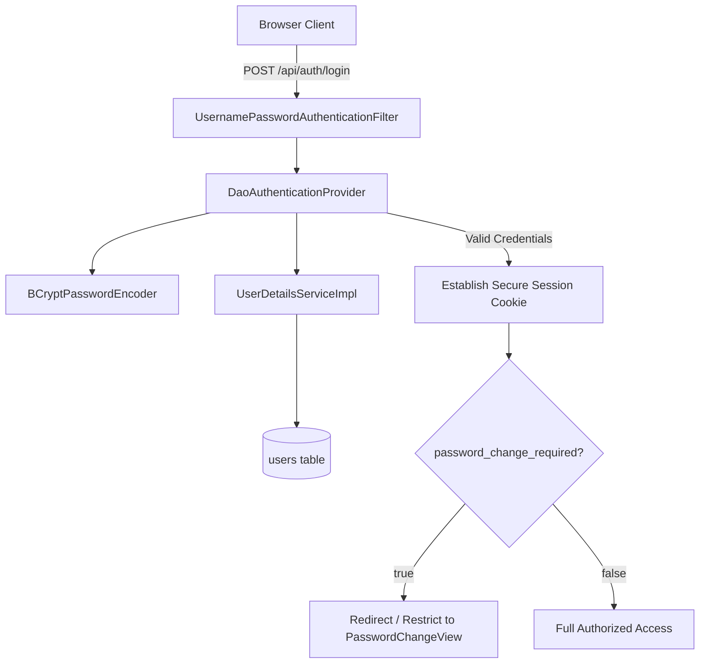

# Security & Authentication

HUD implements a defense-in-depth security model featuring role-based access control, BCrypt password hashing, session hardening, and mandatory first-boot credential rotation.

---

## 1. Authentication Architecture

Authentication is powered by Spring Security ([`SecurityConfig`](file:///home/jakefear/source/hud/hud-backend/src/main/java/com/hud/briefing/SecurityConfig.java)) and a database-backed user store ([`UserDetailsServiceImpl`](file:///home/jakefear/source/hud/hud-backend/src/main/java/com/hud/briefing/UserDetailsServiceImpl.java)):



---

## 2. Access Control & Route Authorization

| Route Pattern | Role Required | Purpose |
| :--- | :--- | :--- |
| `/*` (Frontend HTML/JS/CSS) | Public | SPA static assets and client routing. |
| `/api/auth/login` | Public | Credential authentication. |
| `/api/auth/status` | Public | Client auth probe and permission check. |
| `/api/briefings/**` | Public | Read-only briefing and SITREP retrieval. |
| `/api/investments/**` | Public | Read-only market metrics and predictions. |
| `/api/config/llm/active` | Public | Active brain names for UI model switchers. |
| `/api/config/llm/**` (Mutations) | `ROLE_ADMIN` | Creating, modifying, testing, and deleting Brains. |
| `/api/config/schedules/**` | `ROLE_ADMIN` | Updating cron schedules and maintenance triggers. |
| `/api/pipeline/**` | `ROLE_ADMIN` | Triggering manual briefings and viewing observability logs. |

---

## 3. Initial Boot & Admin Password Setup

On initial startup against an empty database, [`DatabaseSeeder`](file:///home/jakefear/source/hud/hud-backend/src/main/java/com/hud/briefing/DatabaseSeeder.java) automatically initializes the `admin` account:

1. **Explicit Password**:
   ```bash
   export HUD_ADMIN_PASSWORD=your-secure-password
   docker compose up -d
   ```
2. **Generated Password**:
   If `HUD_ADMIN_PASSWORD` is not set, the application generates a cryptographic 16-character password and outputs it once at `WARN` level in the startup logs:
   ```
   WARN [DatabaseSeeder] Seeded admin user with a GENERATED password: <random_16_char_token>
   ```
3. **Mandatory First Login Rotation**:
   In both cases, `password_change_required` is initialized to `true`. The [`PasswordChangeFilter`](file:///home/jakefear/source/hud/hud-backend/src/main/java/com/hud/briefing/PasswordChangeFilter.java) blocks all administrative endpoints until the user submits a new password via `POST /api/auth/change-password`.
